# DevFlow 全流程演示教程（Web 版）

> 本教程由真实浏览器自动化（Playwright）逐步操作生成：每个截图都是一次真实运行中的画面，
> 需求澄清、制图、用例设计全部由 LLM（deepseek-v4-flash）实跑完成，非 Mock 数据。
> 演示时的会话与清单库数据写入沙箱目录，未污染仓库。

## 0. 准备与启动

```bash
pip install -r requirements.txt
python3 -m uvicorn web.server:app --port 8100   # 打开 http://127.0.0.1:8100
```

- 未配置 `.env` 时应用自动进入 **Mock 演示模式**（右上角显示「Mock 模式」徽章），全流程照样走通，方便先看效果。
- 配置了 `.env`（参考 `.env.example`）后走真实 LLM。演示模式与真实模式界面完全一致。
- **运行配置（输入框旁 ⚙）**：可预设 `project_root`、目标模块、边界场景、验收标准。填了 `project_root` 会进入代码模式（含代码检索/代码生成/真实 pytest 执行）；不填为**仅需求模式**（跳过代码环节，用例即交付物）。本教程为仅需求模式。

## 1. 流程总览

| 步骤 | 界面 | 后端动作 |
|---|---|---|
| ① 输入需求 | 首页输入框 / 导入文档 / 示例需求 | 新建会话，写初始 checkpoint |
| ② 澄清追问 | 聊天气泡多轮问答 | `clarify_extract → clarify_validate`，字段不全则 `clarify_build_question` 追问 |
| ③ 需求确认（门禁） | 字段确认卡 | `requirement_review` interrupt，可就地修改 AI 推断字段 |
| ④ 选择图种类 | 图种类卡片 | `graph_type_select` interrupt，规则推断推荐 |
| ⑤ 制图评审（门禁） | Mermaid 预览 | `graph_generate`（带自愈重试）→ `graph_review` interrupt |
| ⑥ 清单路由（门禁） | 清单勾选树 | `checklist_route_match → checklist_route_gate`（库为空时自动跳过） |
| ⑦ 测试设计 | 用例表格卡 | `test_gen`：按方法论产出用例 + 质量自检 |
| ⑧ 人工验收（门禁） | 统计确认卡 | `review` interrupt（代码模式下 `test_run` 先跑真实 pytest） |
| ⑨ 导出 / 沉淀 | 导出条 / 沉淀弹窗 | 导出 Markdown/JSON/CSV；沉淀写入 checklist 库，闭环 |

## 2. 打开首页

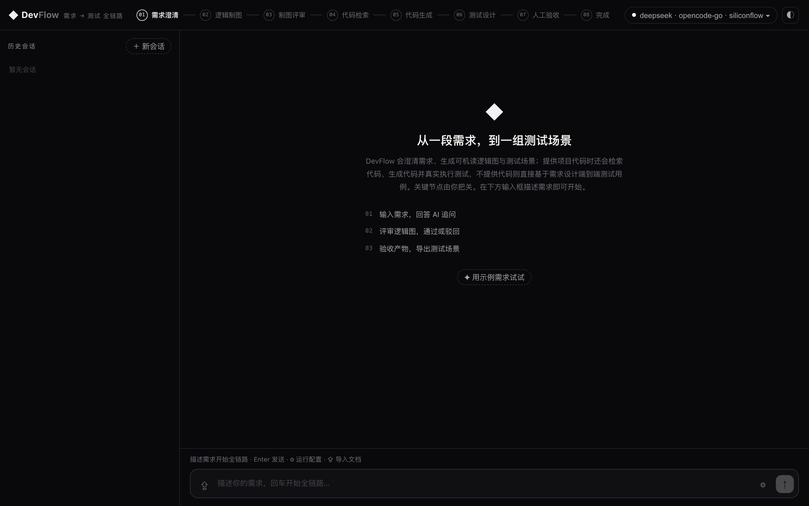

左侧是历史会话（checkpoint 持久化，刷新/重启不丢），中间大输入框就是起点：可以直接打字、点 **⇪** 导入 `.md/.txt/.docx` 需求文档、或点「✦ 用示例需求试试」。顶部进度条（stepper）会随流程推进点亮。

## 3. 配置状态与供应商

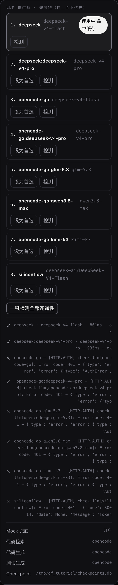

顶栏右侧的配置状态 chip 点开可见供应商链与健康度：当前主供应商 deepseek，后面跟同级备用模型。调用失败会自动切换下一个供应商；鉴权类失败（401/403）直接停用该供应商，面板检测通过后自动解除。全部失败且开启 Mock 兜底时，界面右上角出现「Mock 模式」徽章。

## 4. 输入需求

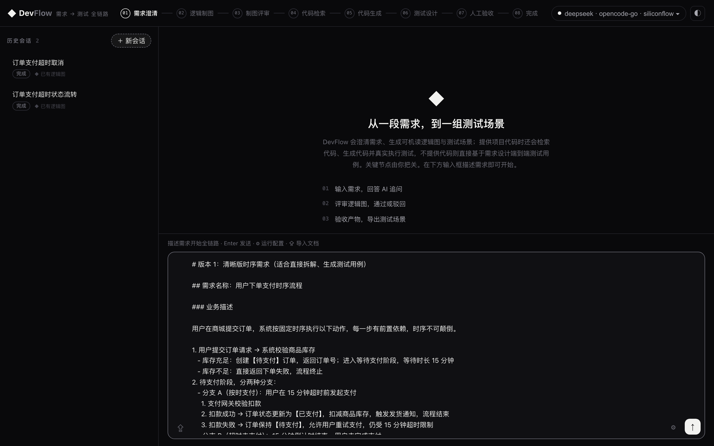

本次演示使用 `tests/fixtures/test_spec.txt`（商城订单支付时序流程：下单校验库存 → 待支付 15 分钟 → 支付成功扣库存发货 / 超时取消释放库存）。回车或点 ↑ 发送。

## 5. 澄清追问（自动多轮）

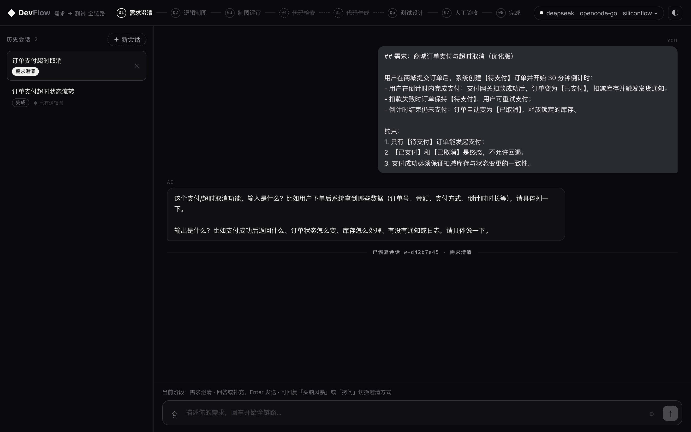

AI 先从描述里抽取结构化需求字段，再校验完备性。缺什么就在对话里追问什么——本次会话 1 需求写得完整，直接通过；会话 2 被追问了「输入/输出约束」，补充回答后继续。追问最多 6 轮（对话式 12 轮），不会死循环。

## 6. 需求确认门禁

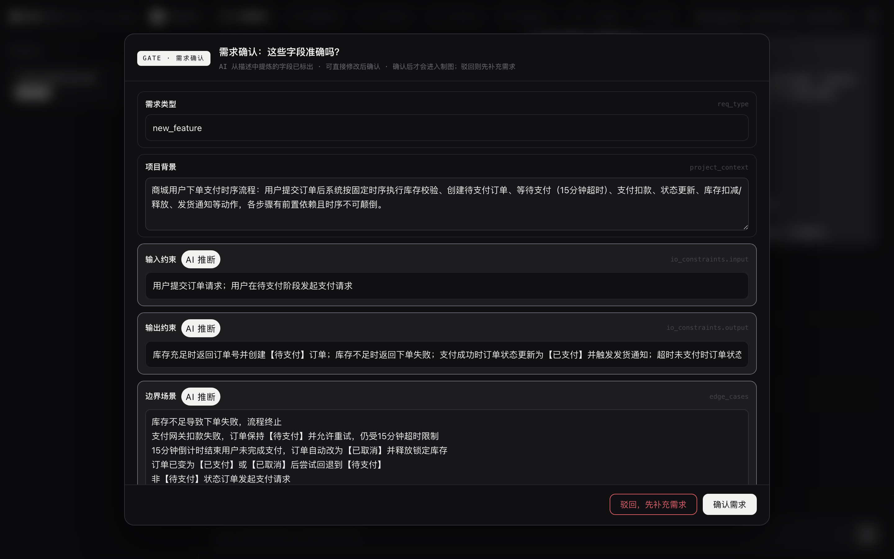

澄清完备后弹出门禁卡：AI 抽取的所有字段逐条列出，带 **AI 推断** 徽章的是模型提炼的内容，需要重点核对。**每个字段都可以就地编辑**，只有改动的字段会回传覆盖；点「确认需求」才进入制图，点「驳回」则退回补充需求。

## 7. 选择图种类

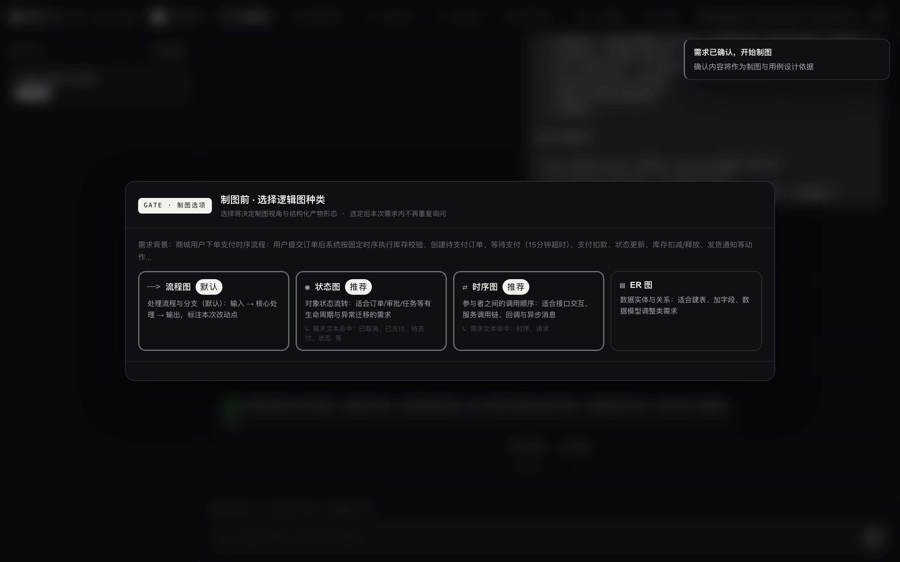

规则引擎按需求特征推荐图种类（流程图/时序图/状态图/ER 图）并标注推荐理由，点卡片即选定。本需求含明显状态流转与超时分支，演示中选了推荐项。

## 8. 制图评审门禁

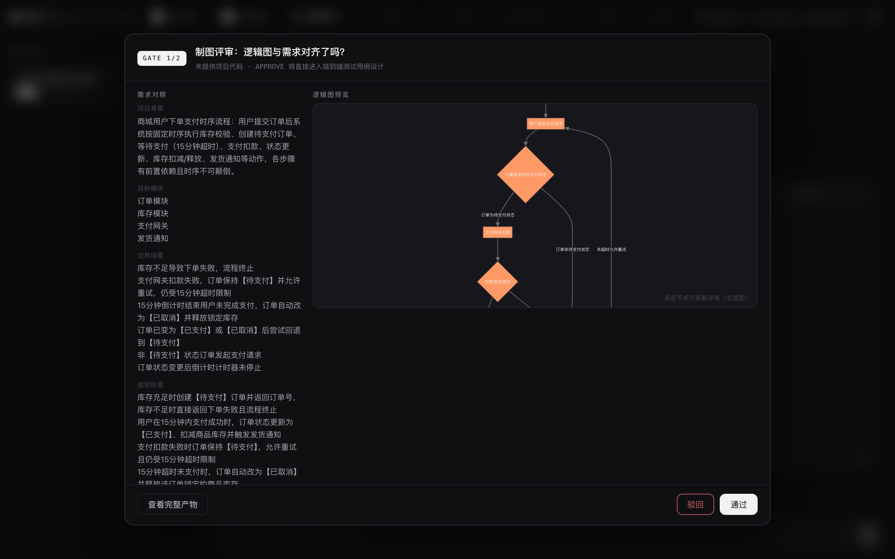

左侧是需求字段对照，右侧是可交互的 Mermaid 逻辑图（点节点可看详情）。图由 LLM 生成，语法错误会先经过自愈修正再展示。确认对齐后点「通过」；有偏差可「驳回」并附意见，意见会回传给制图节点针对性重画。

## 9. 测试设计产出

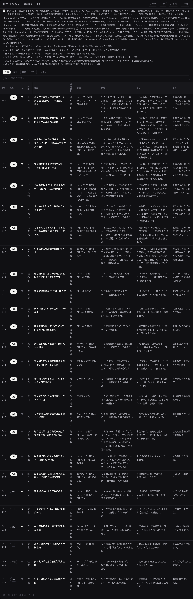

仅需求模式下，制图评审通过后直接进入测试设计。卡片包含：

- **测试概述 + 质量自检**：LLM 输出前的自检结论（覆盖率缺口、豁免说明等）；
- **用例表格**：每条用例有 标识 / 层级（功能·性能·安全）/ 优先级（P0–P2）/ 类型（正向·反向·边界值·等价类·状态流转·场景法·安全·性能）/ 前置 / 步骤 / 预期 / **设计依据**；
- **筛选器**：按层级、优先级、关键词过滤（只影响显示与导出范围，见 [附B](#附b输出的用例怎么被选中有效)）。

本次实跑生成 **26 条用例**：P0×11、P1×15，覆盖正向 3、反向 6、边界值 4、状态流转 4、场景法 3、安全 4、性能 2。

## 10. 人工验收门禁

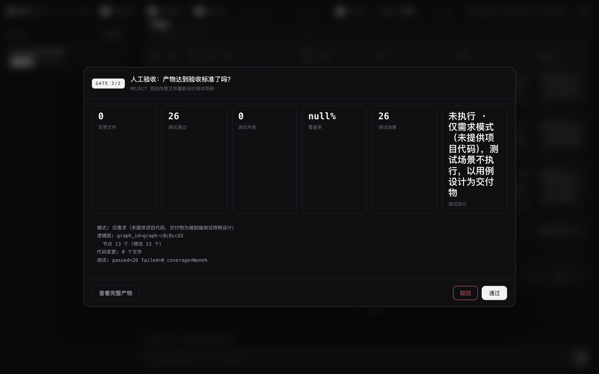

最后一步人工把关：变更文件、测试通过/失败、覆盖率、场景数一目了然（仅需求模式显示「未执行」属预期）。驳回会附意见回炉重新设计用例。

## 11. 导出交付物

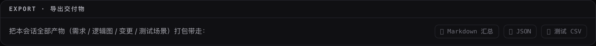

底部导出条把本会话全部产物打包：**Markdown 汇总**（总-分结构：需求清单 → 逻辑图 → 变更 → 测试场景）、**JSON**（结构化全量）、以及测试用例单独的 **CSV**。本次演示的真实导出样例：

- [sample-export.md](sample-export.md)（Markdown 汇总）
- [sample-testcases.csv](sample-testcases.csv)（Excel 可直接打开，26 条用例）

## 12. 沉淀 Checklist（用例 → 业务清单入库）

这是「checklist 是怎么添加的」的核心途径。测试场景卡右上角点 **☰ 沉淀**：

### 12.1 勾选有效用例 + 标记业务类型

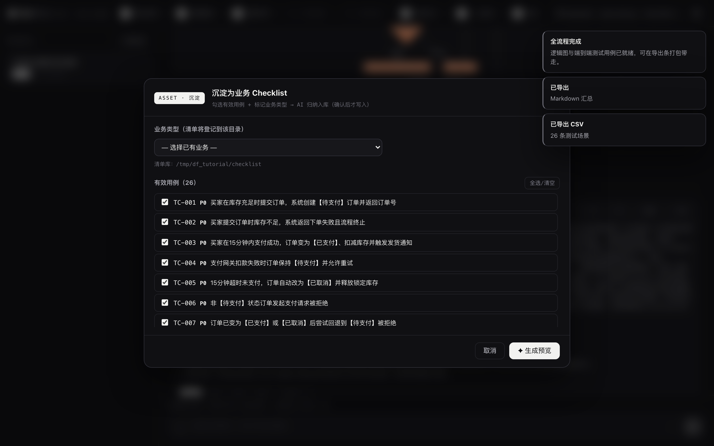

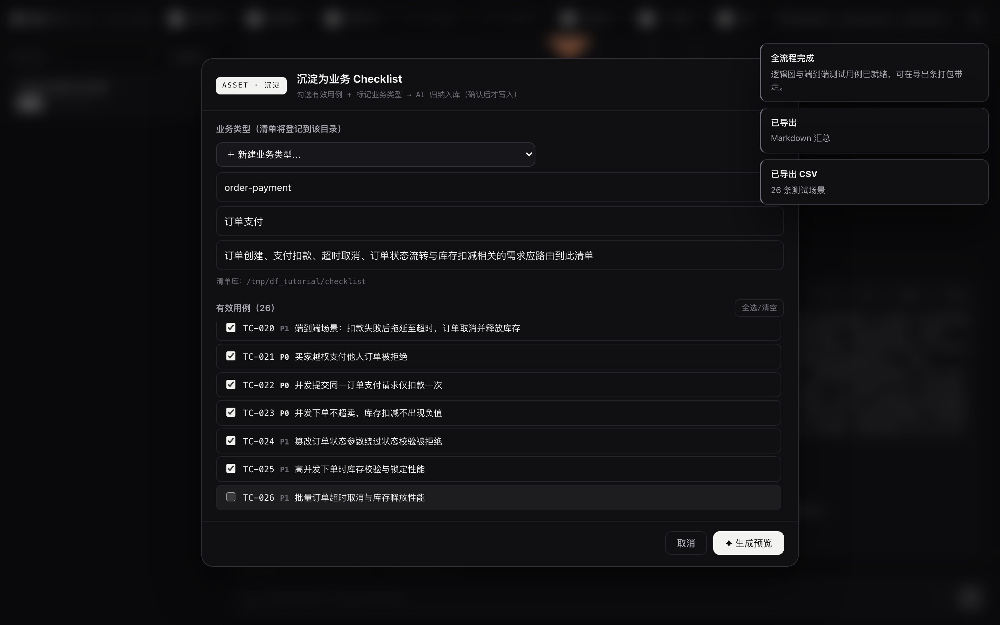

弹窗分两部分：

1. **业务类型**：下拉选择清单库中已有业务，或「＋ 新建业务类型」——填英文目录名（如 `order-payment`，可用 `/` 表示子业务）、中文名、一句话路由描述。本次演示新建 `order-payment · 订单支付`。
2. **有效用例**：默认全选，**逐条勾选你认为评审有效、值得沉淀的用例**（演示中去掉了一条）。至少勾一条，否则无法提交。

### 12.2 AI 归纳生成预览

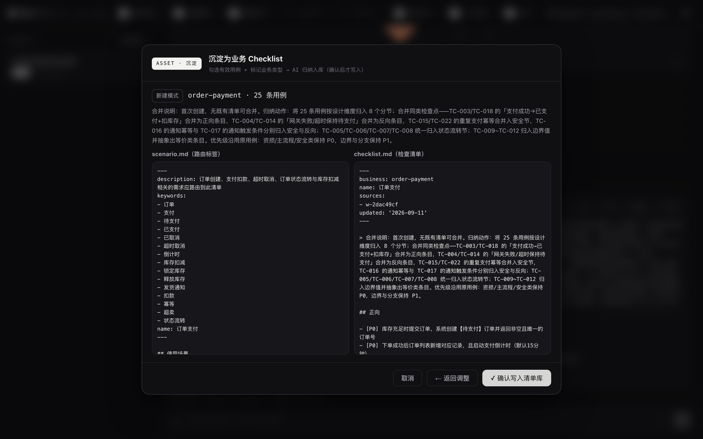

点「✦ 生成预览」，后端把勾选的用例交给 LLM 归纳为一份可复用的业务检查清单：

- 条目是「可验证的一句话检查点」，不是用例原文复制——去掉具体测试数据，保留业务规则与验证点；
- 同类检查点自动去重合并（预览中的「合并说明」会写清合并了哪些用例）；
- 按 正向/反向/边界值/等价类/状态流转/场景法/安全/性能 分节，每条带 P0/P1/P2 优先级；
- `scenario.md` 的 description/keywords 是**路由标签**，供日后语义匹配。

预览确认无误后才落盘——点「✓ 确认写入清单库」前不会写任何文件。

### 12.3 写入清单库

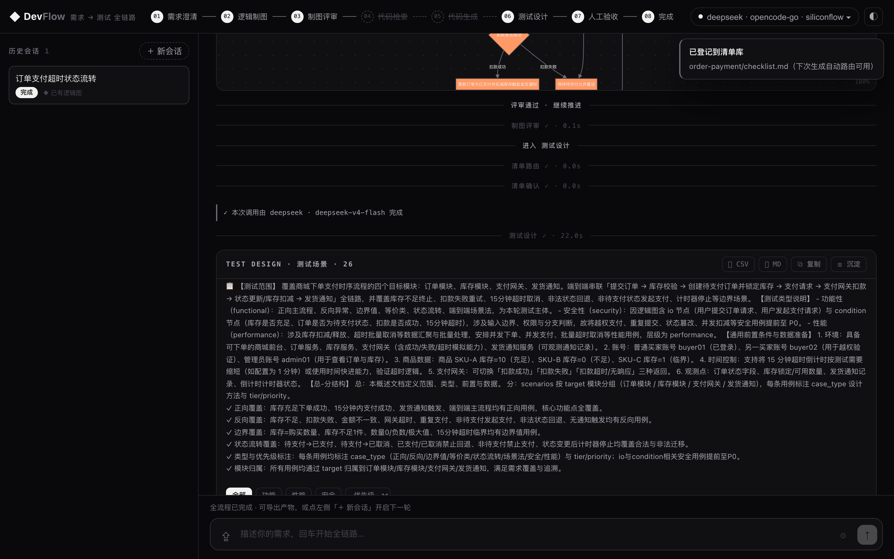

确认后写入清单库目录（本次实跑 25 条有效用例 → 归纳为 31 条检查点，按 8 个分节组织）：

```text
<清单库根>/
└── order-payment/
    ├── scenario.md    # YAML frontmatter 路由标签（name/description/keywords）+ 使用场景
    └── checklist.md   # 分节检查点，每条「- [P0] 可验证检查点」
```

清单库根的解析优先级：环境变量 `DEVFLOW_CHECKLIST_ROOT` > `<project_root>/.checklist`（存在时）> 全局 `data/checklist/`。

### 12.4 闭环：下次生成自动命中

对同业务的新需求再跑一次流程，`checklist_route_match` 节点会用 LLM 把需求与各业务的 frontmatter 摘要做语义匹配，命中后弹出门禁：

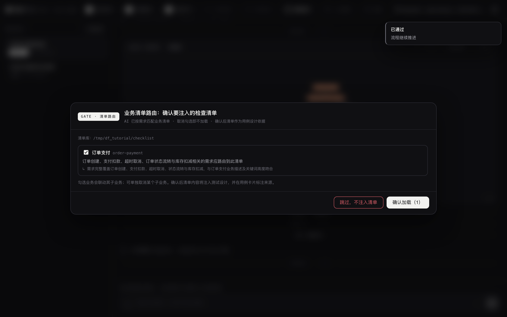

树里勾选要注入的业务（AI 已预选，可取消），确认后清单全文注入测试设计的提示词，并要求**每条清单规则都必须被用例覆盖**——在对应用例的「设计依据」里标注 `清单:<业务>/<条目>`，确实无关的规则要在质量自检里说明豁免原因。

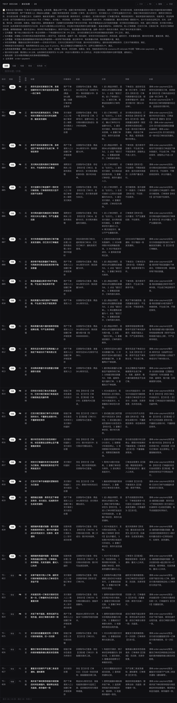

本次闭环实跑：会话 2 的 28 条用例的「设计依据」**全部**标注了 `清单:order-payment/…` 来源，形成了「生成 → 沉淀 → 更准的生成」正循环。

## 附A：Checklist 的三种添加途径

| 途径 | 适用场景 | 操作 |
|---|---|---|
| **UI 沉淀**（本文第 12 节） | 项目跑完一轮，把有效用例经验固化 | 测试卡「☰ 沉淀」→ 勾用例 → AI 归纳 → 确认写入 |
| **手工创建** | 已有现成清单要导入 | 按库目录规范直接写 `scenario.md` + `checklist.md` |
| **CLI 脚手架** | 快速起步看格式 | `python3 -m devflow.cli checklist init`（内置 payment/refund 模板）；`checklist list` / `show` 查看 |

`_` 开头的目录不参与路由。CLI 与 Web 共用同一份清单库。

## 附B：输出的用例怎么被选中「有效」

「有效性」不是一个自动评分，而是**四层机制**，越靠后人为权重越大：

1. **生成期质量自检**（AI 自律）：测试设计提示词要求输出前先自检（P0 是否覆盖所有主流程、边界是否遗漏、清单规则是否逐条核对），结论写进 `self_check` 字段，在用例卡顶部和导出文档里展示。它不删除用例，而是让模型补齐后再输出。
2. **门禁驳回回炉**：人工验收门禁「驳回 + 意见」会带着意见重新设计；代码模式下还有真实 pytest 执行结果覆盖设计态数字，失败自动回代码生成修复（有轮数上限）。
3. **前端筛选**（只影响显示/导出）：用例表按层级/优先级/关键词过滤，数据本身不动。
4. **沉淀时人工勾选**（真正的「选中有效」）：第 12 节的沉淀弹窗里，**由人逐条勾选**哪些用例有效；后端只把勾选的 `case_ids` 交给 LLM 归纳入库，且 prompt 明确输入是「评审确认有效」的用例。被沉淀的规则日后通过路由注入，反哺生成质量。

换言之：**单次会话内用例的有效性靠「自检 + 人工验收」把关；跨会话的有效性靠「沉淀时人工勾选」固化。**

## 附C：数据都在哪

| 数据 | 位置 | 说明 |
|---|---|---|
| 会话/流程状态 | `data/checkpoints.db`（SQLite） | 可用 `CHECKPOINT_SQLITE_PATH` 重定向 |
| 清单库 | `data/checklist/`（或 `.checklist`、`DEVFLOW_CHECKLIST_ROOT`） | 纯文件目录，可直接进版本库 |
| 导出产物 | 浏览器下载 | Markdown / JSON / CSV |

> 本教程演示时以上两者分别重定向到了沙箱目录（`CHECKPOINT_SQLITE_PATH` / `DEVFLOW_CHECKLIST_ROOT`），仓库保持干净。
