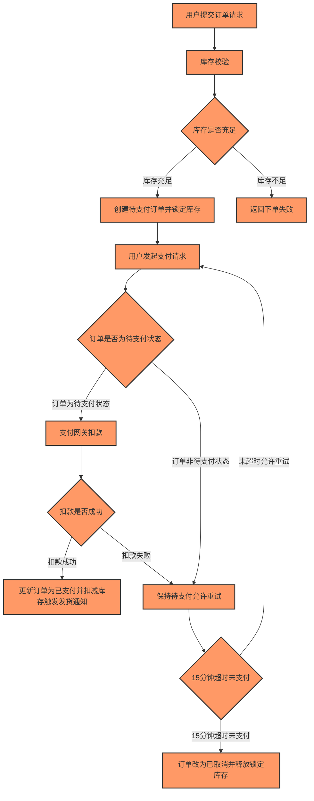

# DevFlow 产物导出 · done

## 需求清单

- **req_type**: `"new_feature"`
- **project_context**: `"商城用户下单支付时序流程：用户提交订单后系统按固定时序执行库存校验、创建待支付订单、等待支付（15分钟超时）、支付扣款、状态更新、库存扣减/释放、发货通知等动作，各步骤有前置依赖且时序不可颠倒。"`
- **target_modules**: `["订单模块", "库存模块", "支付网关", "发货通知"]`
- **existing_code_accessible**: `false`
- **io_constraints**: `{"input": "用户提交订单请求；用户在待支付阶段发起支付请求", "output": "库存充足时返回订单号并创建【待支付】订单；库存不足时返回下单失败；支付成功时订单状态更新为【已支付】并触发发货通知；超时未支付时订单状态改为【已取消】"}`
- **edge_cases**: `["库存不足导致下单失败，流程终止", "支付网关扣款失败，订单保持【待支付】并允许重试，仍受15分钟超时限制", "15分钟倒计时结束用户未完成支付，订单自动改为【已取消】并释放锁定库存", "订单已变为【已支付】或【已取消】后尝试回退到【待支付】", "非【待支付】状态订单发起支付请求", "订单状态变更后倒计时计时器未停止"]`
- **acceptance_criteria**: `["库存充足时创建【待支付】订单并返回订单号，库存不足时直接返回下单失败且流程终止", "用户在15分钟内支付成功时，订单状态更新为【已支付】、扣减商品库存并触发发货通知", "支付扣款失败时订单保持【待支付】，允许重试且仍受15分钟超时限制", "15分钟超时未支付时，订单自动改为【已取消】并释放该订单锁定的商品库存", "订单一旦变为【已支付】或【已取消】，状态不允许回退到【待支付】", "只有【待支付】状态的订单才允许发起支付请求", "倒计时仅在订单为【待支付】状态时持续计时，订单状态变更后计时器停止"]`

## 逻辑图

graph_id: `graph-c8c8ccd3`

## 测试用例文档

【测试范围】
覆盖商城下单支付时序流程的四个目标模块：订单模块、库存模块、支付网关、发货通知。端到端串联「提交订单 → 库存校验 → 创建待支付订单并锁定库存 → 支付请求 → 支付网关扣款 → 状态更新/库存扣减 → 发货通知」全链路，并覆盖库存不足终止、扣款失败重试、15分钟超时取消、非法状态回退、非待支付状态发起支付、计时器停止等边界场景。

【测试类型说明】
- 功能性（functional）：正向主流程、反向异常、边界值、等价类、状态流转、端到端场景法，为本轮测试主体。
- 安全性（security）：因逻辑图含 io 节点（用户提交订单请求、用户发起支付请求）与 condition 节点（库存是否充足、订单是否为待支付状态、扣款是否成功、15分钟超时），涉及输入边界、权限与分支判断，故将越权支付、重复提交、状态篡改、并发扣减等安全用例提前至 P0。
- 性能（performance）：涉及库存扣减/释放、超时批量取消等数据汇聚与批量处理，安排并发下单、并发支付、批量超时取消等性能用例，层级为 performance。

【通用前置条件与数据准备】
1. 环境：具备可下单的商城前台、订单服务、库存服务、支付网关（含成功/失败/超时模拟能力）、发货通知服务（可观测通知记录）。
2. 账号：普通买家账号 buyer01（已登录）、另一买家账号 buyer02（用于越权验证）、管理员账号 admin01（用于查看订单与库存）。
3. 商品数据：商品 SKU-A 库存=10（充足）、SKU-B 库存=0（不足）、SKU-C 库存=1（临界）。
4. 时间控制：支持将 15 分钟超时倒计时按测试需要缩短（如配置为 1 分钟）或使用时间快进能力，验证超时逻辑。
5. 支付网关：可切换「扣款成功」「扣款失败」「扣款超时/无响应」三种返回。
6. 观测点：订单状态字段、库存锁定/可用数量、发货通知记录、倒计时计时器状态。

【总-分结构】
总：本概述文档定义范围、类型、前置与数据。
分：scenarios 按 target 模块分组（订单模块 / 库存模块 / 支付网关 / 发货通知），每条用例标注 case_type 设计方法与 tier/priority。

用例总数：26（passed=26 failed=0）
- 优先级口径：P0 核心路径与关键校验 · P1 边界与重要异常 · P2 次要异常与体验
- 类型口径：正向 / 反向 / 边界值 / 等价类 / 状态流转 / 场景法 / 性能 / 安全

### 2.1 订单模块

| 标识 | 层级 | 优先级 | 类型 | 标题 | 前置 | 步骤 | 预期 | 依据 |
|---|---|---|---|---|---|---|---|---|
| TC-001 | functional | P0 | 正向 | 买家在库存充足时提交订单，系统创建【待支付】订单并返回订单号 | buyer01 已登录；SKU-A 库存=10；库存服务正常。 | 1. 进入商品 SKU-A 详情页，选择数量 1，点击「立即购买/提交订单」。 2. 在确认页点击「提交订单」。 3. 观察返回结果与订单列表。 | 1. 页面返回下单成功并展示订单号（非空、唯一）。 2. 订单列表新增一条记录，状态为【待支付】。 3. 系统提示支付倒计时 15 分钟开始。 | 覆盖验收标准「库存充足时创建待支付订单并返回订单号」。 |
| TC-003 | functional | P0 | 正向 | 买家在15分钟内支付成功，订单变为【已支付】、扣减库存并触发发货通知 | buyer01 已创建 SKU-A 待支付订单；支付网关配置为扣款成功；倒计时未超时。 | 1. 在订单列表找到该【待支付】订单，点击「去支付」。 2. 选择支付方式并确认支付。 3. 等待支付网关返回。 4. 查看订单状态、库存数量、发货通知记录。 | 1. 支付网关扣款成功。 2. 订单状态由【待支付】更新为【已支付】。 3. 商品库存按购买数量扣减（锁定库存转为实际扣减）。 4. 发货通知服务生成一条对应订单的发货通知记录。 | 覆盖验收标准「15分钟内支付成功→已支付+扣减库存+触发发货通知」。 |
| TC-005 | functional | P0 | 状态流转 | 15分钟超时未支付，订单自动改为【已取消】并释放锁定库存 | buyer01 有【待支付】订单且已锁定库存；倒计时配置为可缩短（如1分钟）或使用时间快进。 | 1. 创建【待支付】订单后不进行任何支付操作。 2. 等待倒计时结束（或快进至超时）。 3. 查看订单状态与库存可用数量。 | 1. 订单状态由【待支付】自动变更为【已取消】。 2. 该订单锁定的库存被释放，可用库存恢复。 3. 订单不可再发起支付。 | 覆盖验收标准「15分钟超时→已取消+释放锁定库存」。 |
| TC-006 | functional | P0 | 状态流转 | 非【待支付】状态订单发起支付请求被拒绝 | 存在【已支付】订单与【已取消】订单各一条。 | 1. 对【已支付】订单尝试发起支付请求（页面入口或接口）。 2. 对【已取消】订单尝试发起支付请求。 3. 观察返回与订单状态。 | 1. 两种情况下均拒绝支付，提示「订单状态不允许支付」类文案。 2. 订单状态保持不变，不进入支付网关扣款。 3. 不产生任何库存或通知副作用。 | 覆盖验收标准「只有待支付状态订单才允许发起支付请求」。 |
| TC-007 | functional | P0 | 状态流转 | 订单已变为【已支付】或【已取消】后尝试回退到【待支付】被拒绝 | 存在【已支付】订单与【已取消】订单各一条。 | 1. 通过后台或接口尝试将【已支付】订单状态改回【待支付】。 2. 尝试将【已取消】订单状态改回【待支付】。 3. 查看订单状态。 | 1. 两次回退操作均被拒绝，提示状态不可回退。 2. 订单状态保持【已支付】/【已取消】不变。 3. 不重新生成倒计时，不重新锁定库存。 | 覆盖验收标准「已支付/已取消不允许回退到待支付」。 |
| TC-008 | functional | P0 | 状态流转 | 订单状态变更后倒计时计时器停止 | buyer01 有【待支付】订单，倒计时运行中。 | 1. 在倒计时未结束时完成支付使订单变为【已支付】。 2. 观察该订单倒计时是否继续。 3. 另建一单，等待超时变为【已取消】，观察倒计时是否继续。 | 1. 订单变为【已支付】后倒计时立即停止，不再触发超时取消。 2. 订单变为【已取消】后倒计时停止，不重复触发取消。 3. 已支付订单不会被超时逻辑误改为已取消。 | 覆盖验收标准「倒计时仅在待支付状态持续计时，状态变更后停止」。 |
| TC-011 | functional | P1 | 边界值 | 购买数量为0或负数时提交订单被拒绝 | buyer01 已登录；SKU-A 库存充足。 | 1. 尝试提交购买数量为 0 的订单。 2. 尝试提交购买数量为 -1 的订单。 3. 观察返回。 | 1. 均提示数量非法/必须大于0，下单失败。 2. 不生成订单，不锁定库存。 | 数量下界边界与无效等价类。 |
| TC-018 | functional | P1 | 场景法 | 端到端场景：库存充足→支付成功→扣库存→发货通知全链路 | buyer01 已登录；SKU-A 库存=10；支付网关成功。 | 1. 提交 SKU-A 数量2的订单，记录订单号。 2. 校验订单为【待支付】、库存锁定2。 3. 15分钟内发起支付并成功。 4. 校验订单【已支付】、可用库存减2、发货通知生成。 | 全链路各节点按固定时序执行，最终订单【已支付】、库存正确扣减、发货通知存在。 | 端到端主流程场景串联多模块。 |
| TC-020 | functional | P1 | 场景法 | 端到端场景：扣款失败后拖延至超时，订单取消并释放库存 | buyer01 有【待支付】订单；网关持续失败。 | 1. 多次支付失败。 2. 等待超过15分钟。 3. 校验订单【已取消】、库存释放、无发货通知。 | 超时后订单取消、库存释放、无通知，重试入口关闭。 | 失败+超时组合场景。 |
| TC-021 | security | P0 | 安全 | 买家越权支付他人订单被拒绝 | buyer02 登录；存在 buyer01 的【待支付】订单。 | 1. buyer02 通过接口/URL 尝试对 buyer01 的订单发起支付。 2. 观察返回与订单状态。 | 1. 拒绝访问，提示无权限。 2. buyer01 订单状态不变，不扣款。 | io 节点权限校验，越权访问提前至P0。 |
| TC-024 | security | P1 | 安全 | 篡改订单状态参数绕过状态校验被拒绝 | 存在【已取消】订单。 | 1. 构造请求将订单状态参数改为【待支付】发起支付。 2. 观察返回。 | 1. 服务端以真实状态校验，拒绝支付。 2. 订单状态不变。 | 服务端状态校验防篡改。 |
| TC-026 | performance | P1 | 性能 | 批量订单超时取消与库存释放性能 | 批量生成大量【待支付】订单并使其超时。 | 1. 触发批量超时任务。 2. 监控取消耗时与库存释放一致性。 | 1. 批量取消在可接受时间内完成。 2. 所有订单取消且库存正确释放。 | 批量处理性能与一致性。 |

### 2.2 库存模块

| 标识 | 层级 | 优先级 | 类型 | 标题 | 前置 | 步骤 | 预期 | 依据 |
|---|---|---|---|---|---|---|---|---|
| TC-002 | functional | P0 | 反向 | 买家提交订单时库存不足，系统返回下单失败且流程终止 | buyer01 已登录；SKU-B 库存=0。 | 1. 进入 SKU-B 详情页，选择数量 1，点击「提交订单」。 2. 观察返回结果。 3. 查看订单列表与库存数量。 | 1. 页面提示「下单失败：库存不足」。 2. 不生成任何订单记录（订单列表无新增）。 3. 库存数量保持 0 不变，不产生锁定。 4. 流程终止，不进入支付环节。 | 覆盖验收标准「库存不足时直接返回下单失败且流程终止」。 |
| TC-009 | functional | P1 | 边界值 | 库存临界值：库存等于购买数量时下单成功并锁定全部库存 | buyer01 已登录；SKU-C 库存=1。 | 1. 对 SKU-C 提交数量 1 的订单。 2. 查看订单与库存。 | 1. 下单成功，返回订单号，订单为【待支付】。 2. 可用库存变为 0，锁定库存为 1。 | 库存=购买数量为边界值，验证临界充足判定。 |
| TC-010 | functional | P1 | 边界值 | 购买数量超过库存1件时下单失败 | SKU-C 库存=1。 | 1. 对 SKU-C 提交数量 2 的订单。 2. 查看返回与库存。 | 1. 提示库存不足，下单失败。 2. 不生成订单，库存保持 1 不变。 | 边界外无效值验证库存校验下界。 |
| TC-012 | functional | P1 | 边界值 | 购买数量为极大值（如999999）时按库存校验结果处理 | SKU-A 库存=10。 | 1. 提交购买数量 999999 的订单。 2. 观察返回。 | 1. 因库存不足返回下单失败，或提示数量超出上限。 2. 不生成订单，不产生库存锁定。 | 数量上界边界与溢出防护。 |
| TC-023 | security | P0 | 安全 | 并发下单不超卖，库存扣减不出现负值 | SKU-C 库存=1，多个买家并发下单。 | 1. 多用户同时对 SKU-C 提交数量1订单。 2. 查看成功订单数与库存。 | 1. 仅1单成功，其余提示库存不足。 2. 库存不为负，锁定数量正确。 | condition 节点库存判定并发安全。 |
| TC-025 | performance | P1 | 性能 | 高并发下单时库存校验与锁定性能 | SKU-A 库存充足，压测工具就绪。 | 1. 以目标TPS并发提交订单。 2. 监控响应时间、错误率、库存一致性。 | 1. 响应时间在阈值内，无超卖。 2. 库存最终一致。 | 库存汇聚/锁定为性能敏感点。 |

### 2.3 支付网关

| 标识 | 层级 | 优先级 | 类型 | 标题 | 前置 | 步骤 | 预期 | 依据 |
|---|---|---|---|---|---|---|---|---|
| TC-004 | functional | P0 | 反向 | 支付网关扣款失败时订单保持【待支付】并允许重试 | buyer01 有【待支付】订单；支付网关配置为扣款失败；倒计时未超时。 | 1. 对该【待支付】订单点击「去支付」并确认。 2. 支付网关返回扣款失败。 3. 查看订单状态与库存。 4. 再次点击「去支付」重试。 | 1. 页面提示支付失败原因。 2. 订单状态仍为【待支付】，未变为已支付。 3. 库存不扣减、锁定库存不释放。 4. 允许再次发起支付，且仍受原 15 分钟超时限制。 | 覆盖验收标准「扣款失败保持待支付、允许重试且仍受15分钟限制」。 |
| TC-013 | functional | P1 | 反向 | 支付金额与订单金额不一致时支付被拒绝 | buyer01 有【待支付】订单，订单金额=100。 | 1. 篡改支付请求金额为 1 元发起支付。 2. 观察返回与订单状态。 | 1. 支付被拒绝，提示金额不一致。 2. 订单保持【待支付】，不扣款、不扣库存。 | 金额校验反向用例，防止少付。 |
| TC-014 | functional | P1 | 反向 | 支付网关超时无响应时订单保持【待支付】且不重复扣款 | 支付网关配置为超时/无响应。 | 1. 对【待支付】订单发起支付。 2. 网关无响应，等待超时。 3. 查看订单状态与账户扣款记录。 | 1. 提示支付处理中或失败。 2. 订单保持【待支付】，允许重试。 3. 不产生重复扣款，库存不扣减。 | 外部依赖异常与幂等性反向验证。 |
| TC-015 | functional | P1 | 反向 | 支付成功后重复提交同一订单支付请求不重复扣款 | 订单已支付成功。 | 1. 对已支付订单再次发起支付请求。 2. 查看扣款记录与订单状态。 | 1. 拒绝重复支付，提示订单已支付。 2. 仅一次扣款，订单保持【已支付】。 | 重复提交幂等性验证。 |
| TC-019 | functional | P1 | 场景法 | 端到端场景：扣款失败重试后成功，仍受15分钟限制 | buyer01 有【待支付】订单；网关先失败后成功。 | 1. 首次支付失败，订单保持【待支付】。 2. 在15分钟内重试支付并成功。 3. 校验订单【已支付】、库存扣减、发货通知。 | 重试成功后正常完成支付流程，未超时。 | 失败重试分支场景。 |
| TC-022 | security | P0 | 安全 | 并发提交同一订单支付请求仅扣款一次 | 【待支付】订单，网关成功。 | 1. 并发发起多笔相同订单支付请求。 2. 查看扣款次数与订单状态。 | 1. 仅一次扣款成功。 2. 订单最终为【已支付】，无重复扣款。 | 并发幂等与资金安全。 |

### 2.4 发货通知

| 标识 | 层级 | 优先级 | 类型 | 标题 | 前置 | 步骤 | 预期 | 依据 |
|---|---|---|---|---|---|---|---|---|
| TC-016 | functional | P1 | 正向 | 支付成功后发货通知仅触发一次且内容正确 | 订单支付成功。 | 1. 完成一笔订单支付。 2. 查看发货通知记录。 3. 再次触发状态更新（如重复回调）。 | 1. 生成一条发货通知，包含订单号、商品、收货信息。 2. 重复回调不产生第二条通知（幂等）。 | 发货通知正确性与幂等性。 |
| TC-017 | functional | P1 | 反向 | 支付失败或超时取消的订单不触发发货通知 | 存在支付失败订单与超时取消订单。 | 1. 查看支付失败订单的通知记录。 2. 查看超时取消订单的通知记录。 | 1. 两类订单均无发货通知记录。 2. 仅【已支付】订单触发通知。 | 通知触发条件反向验证。 |

### 质量自检

- 正向覆盖：库存充足下单成功、15分钟内支付成功、发货通知触发、端到端主流程均有正向用例，核心功能点全覆盖。
- 反向覆盖：库存不足、扣款失败、金额不一致、网关超时、重复支付、非待支付发起支付、非法状态回退、无通知触发均有反向用例。
- 边界覆盖：库存=购买数量、库存不足1件、数量0/负数/极大值、15分钟超时临界均有边界值用例。
- 状态流转覆盖：待支付→已支付、待支付→已取消、已支付/已取消禁止回退、非待支付禁止支付、状态变更后计时器停止均覆盖合法与非法迁移。
- 类型与优先级标注：每条用例均标注 case_type（正向/反向/边界值/等价类/状态流转/场景法/安全/性能）与 tier/priority；io与condition相关安全用例提前至P0。
- 模块归属：所有用例均通过 target 归属到订单模块/库存模块/支付网关/发货通知，满足需求覆盖与追溯。
