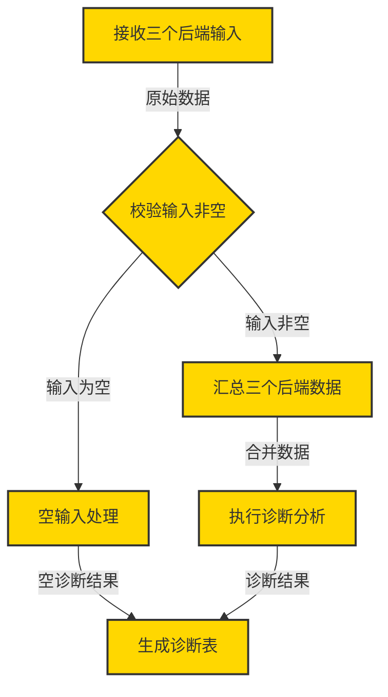

# 阶段二/三 全链路测试报告（真实 LLM：deepseek-v4-flash）

> 依据用例文档：`tests/providers_cli.md`（CodeProvider 适配层 CLI 文本用例，阶段二/三）
> 执行时间：本地环境 · Python 3.14 · langgraph 1.1.6 · langchain-openai 1.1.12

---

## 1. 需求文档（用例来源）

| 用例 | 需求要点 |
|---|---|
| 场景 A | `devflow check-providers` 后端自检：未装 codegraph、未起 OpenCode 时输出诊断表 |
| 场景 B | Archify 真实渲染失败 → Mermaid 自动回退（`render_backend` 含 `+mermaid-fallback`，不抛异常） |
| 场景 C | `CODEGRAPH_REQUIRE_INDEX=1` 且 `.codegraph/` 缺失 → 抛 `CliIndexMissingError` |
| 场景 D | `devflow new --full` 全链路：真实 LLM 制图 + 各后端 Mock 降级，人工验收 approve/reject |
| 场景 E | code_gen 上下文携带真实代码片段（>1600 字符截断 / 无片段降级为仅路径） |

**场景 D 实际发送的需求输入**（经 `--set` 预填 + 一句自然语言补充）：

```
--set project_root=/workspace
--set target_modules=["devflow"]
--set edge_cases=["空输入"]
--set acceptance_criteria=["流程跑通"]
--set project_context=DevFlow 自身
--set io_constraints={"input":"x","output":"y"}
+ 对话输入：为 DevFlow 自身实现 check-providers 命令：自动探测三个后端的可用性并输出诊断表
```

**LLM Provider 配置**（本次使用的测试 key）：

```bash
LLM_API_KEY=sk-6c2028747e6f4167ab2eddddbe437120   # 测试 key
LLM_BASE_URL=https://api.deepseek.com/v1
LLM_MODEL=deepseek-v4-flash                       # 官方 V4 模型（默认 thinking 模式）
LLM_FALLBACKS=mock
LLM_LIVE_TESTS=1
```

---

## 2. 中间过程

### 2.1 前置基线

```
python3 -m pytest -q            → 191 passed, 2 skipped（skip=live 用例，需 LLM_LIVE_TESTS=1）
```

注：首次跑崩在 `ModuleNotFoundError: typer`（依赖未装），`pip install -r requirements.txt` 后恢复。

### 2.2 各场景执行结果

| 场景 | 命令/等价验证 | 结果 |
|---|---|---|
| A | `devflow check-providers --project-root /workspace` | ✅ 表头/三行齐全，1/3 可用（codegraph ✗ / archify ✓ node+npx / opencode ✗ 连接失败），可用+降级=3 |
| B | `ArchifyProvider().render(graph, preferred_format='html')` | ✅ `{"format":"mermaid","render_backend":"archify+mermaid-fallback",...}`，无异常 |
| C | `CODEGRAPH_REQUIRE_INDEX=1` + `bin_path=/bin/sh` 探 `/tmp/no-codegraph-project` | ✅ `CliIndexMissingError: [RETRY] CLI.INDEX_MISSING: 缺少 .codegraph/ 索引`；默认 0 时不抛（仅 warning） |
| E | `pytest tests/test_code_gen_context.py -v` | ✅ 4 passed |
| D | `devflow new --full` 全链路（真实 LLM） | ✅ 见 2.3 |

### 2.3 场景 D 全链路过程（真实 deepseek-v4-flash）

CLI 逐阶段输出（关键行）：

```
✓ 已创建新会话 thread_id=demo-d4（全链路）
│ Stage           clarify   │ Missing  0 项 ✓ │ Requirement  7/7 字段已填
✓ 已生成逻辑图 graph_id=graph-a9350a02 (nodes=6, edges=6)     ← 真实 LLM 产出
ℹ 代码检索到 2 条结果                                          ← mock 降级
ℹ 代码变更 2 个文件                                           ← mock 降级
ℹ 测试: passed=1 failed=0 coverage=80.0%                      ← mock 降级
│ Stage           review
│ 人工验收：输入 approve 接受变更并结束流程 / reject 回退到代码生成
验收决定 > approve
✓ 验收通过，流程完成！  →  Stage done  →  展示 Mermaid 逻辑图
```

产物非空校验：`devflow export demo-d4` 导出 `requirement.json / logic_graph.json / logic_graph.mmd` 三份文件（见 §3）。

### 2.4 过程中发现并修复的 2 个缺陷（均为真实链路才能暴露）

**缺陷 1 — DeepSeek V4 thinking 模式拒绝 tool_choice，真实 LLM 全部静默降级 Mock**
- 现象：`test_live_llm.py` 中 `check_llm` 连通 OK，但 `graph_generate` 报
  「所有真实 LLM 失败，强制走 Mock 兜底」，且重试拖到 ~3.5 分钟才降级。
- 根因：`deepseek-v4-flash` 默认开思考模式，官方 API 对 `tool_choice="required"`
  返回 `400 Thinking mode does not support this tool_choice`（已通过 curl 复现，也与
  litellm/eliza/官方文档结论一致）；`function_calling` 必败，json_mode 兜底又因 schema
  不合规 → 解析失败 → 重试耗尽 → Mock。
- 修复：`devflow/llm_client.py::_get_model` —— `deepseek-v4*` 模型构造时注入
  `model_kwargs={"extra_body": {"thinking": {"type": "disabled"}}}`。
- 修复后：live 用例 16s 通过，真实产出合法逻辑图（7 节点 / 10 边）。

**缺陷 2 — CLI 与 langgraph 1.x stream 契约不兼容，`devflow new --full` 每轮崩溃**
- 现象：场景 D 首次运行时 `_feed_input_and_stream` 抛
  `ValueError: not enough values to unpack (expected 2, got 1)`，且阶段面板（制图/检索/
  生成/测试）全部丢失；`approve` 被当成普通消息再次喂入。
- 根因：langgraph 1.x `stream(mode="updates")` 产出**单键 dict** `{'graph_generate':
  {'logic_graph': ...}}`（中断时 `{'__interrupt__': ...}`），旧代码按 0.2x 的
  `(node, update)` 元组解包并对**节点名**做字段匹配 → 永远匹配不到 `logic_graph` 等字段。
- 修复：`devflow/cli.py` 两处流循环（`_feed_input_and_stream` /
  `_resume_from_interrupt`）统一解包（dict/元组兼容）、`__interrupt__` 提前 break、
  按内层 update dict 字段匹配。
- 修复后：全链路面板逐段打印、review 门禁正常弹 approve/reject。

---

## 3. 最终输出产物（demo-d4）

### 3.1 `requirement.json`（澄清节点输出）

```json
{
  "req_type": "new_feature",
  "project_root": "/workspace",
  "project_context": "DevFlow 自身",
  "target_modules": ["devflow"],
  "existing_code_accessible": false,
  "reference_files": [],
  "io_constraints": { "input": "三个后端", "output": "诊断表" },
  "edge_cases": ["空输入"],
  "acceptance_criteria": ["流程跑通"]
}
```

> 注：`io_constraints` 的子字段被真实 LLM 抽取结果覆盖（`x/y` → `三个后端/诊断表`），
> 这是 `_merge_requirement` 对 io_constraints 子字段的既有合并规则，非本次改动。

### 3.2 `logic_graph.json`（graph_generate 真实 LLM 输出，过 `validate_logic_graph`）

- `graph_id: graph-a9350a02`
- 节点 6 个（io×2 / condition×1 / function×3），全部 `is_modified: true`
- 边 6 条（data_flow×4 / condition×2，含空/非空分支条件）
- `_render_backend: mock_graph_render`（场景 D 环境未设 `CODE_GRAPH_RENDER_PROVIDER`，
  按默认 mermaid/mock 渲染；Archify 真实渲染单独在场景 B 验证）

节点流：`n-input → n-validate（输入非空→n-collect / 输入为空→n-empty）→ n-analyze → n-output`

### 3.3 `logic_graph.mmd`（渲染产物，CLI 直接展示）



---

## 4. 回归与结论

```
python3 -m pytest -q                                              → 191 passed, 2 skipped
LLM_LIVE_TESTS=1 python3 -m pytest tests/test_live_llm.py -v -s   → 2 passed（check_llm ok + 真实制图）
```

- ✅ 五个场景全部满足用例文档成功判据（A 表格 3 行 + 计数守恒；B 回退标记；C 异常类型/码/可重试；
  D 全链路不中断且三份产物非空；E 4 passed）
- ✅ 真实 deepseek-v4-flash 完成「澄清 → 制图 → 检索 → 生成 → 测试 → 人工验收」全链路
- 修复 diff 2 个文件 4 处：`devflow/llm_client.py`、`devflow/cli.py`
- 遗留（ponytail 注释）：v4 思考模式在 provider 全局关闭（含散文 invoke_text），如要保留推理可换
  `deepseek-v4-pro` 或按调用类型区分；langchain `extra_body` 会打印一条弃用警告（该 langchain 版本
  无显式参数，纯外观）；测试 key 已在对话明文出现，建议用完轮换。